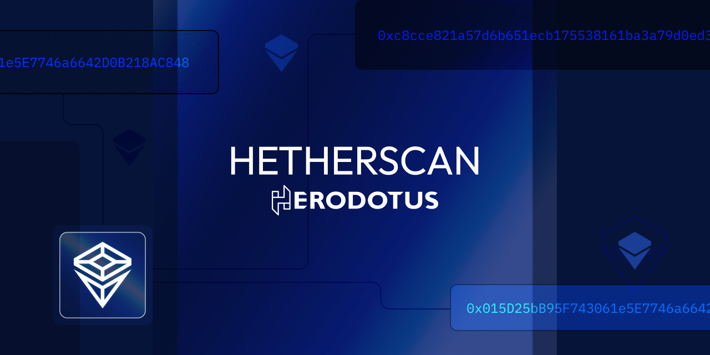

[![GPLv3 licensed][gpl3-badge]][gpl3-url]

[gpl3-badge]: https://img.shields.io/badge/license-GPLv3-blue
[gpl3-url]: LICENSE

# Hetherscan

> Hetherscan is a superset of [Betherscan](https://github.com/tiagofneto/betherscan) by [tiagofneto](https://github.com/tiagofneto), focusing on adding Diamond Contract support and various ways to interact with the [Herodotus Storage Proofs API](https://docs.herodotus.cloud/storage-proofs-api/introduction) from within the block explorer.

Hetherscan is a browser extension designed to enhance the user experience on block explorer platforms. By integrating additional information directly into the pages, Hetherscan aims to provide a more comprehensive view of blockchain data, making it easier for developers and advanced users to gather all the information they need without the need to navigate away from the explorer.

<!-- TODO: Uncomment this with the extension URL once it's published -->
<!--  -->

## Features

Hetherscan adds new data fields & features to various sections of block explorers, detailed as follows:

### Accounts

#### Smart Contracts

- **Storage root**: Root of the [storage Trie](https://ethereum.org/developers/docs/data-structures-and-encoding/patricia-merkle-trie#storage-trie)
- **Code hash**: Keccak256 hash of the EVM code of the account
- **🛰️ Prove Account Properties**: Select the properties you want to prove and prove them with [Herodotus Storage Proofs API](https://docs.herodotus.cloud/storage-proofs-api/introduction) with a single click
- **🛰️ Prove ETH Balance**: Prove the ETH balance of the account with [Herodotus Storage Proofs API](https://docs.herodotus.cloud/storage-proofs-api/introduction)
- **🛰️ Read as Diamond**: Treat the contract as a [Diamond Contract](https://eips.ethereum.org/EIPS/eip-2535) and read any of it's facets' functions
- **🛰️ Write as Diamond**: Treat the contract as a [Diamond Contract](https://eips.ethereum.org/EIPS/eip-2535) and write to any of it's facets' functions
- **🛰️ Diamond Config**: Allows for configuring the function selector and the function name that will be used to get all facet addresses of the Diamond contract (useful for custom Diamond implementations & variations)

#### EOAs

- **Nonce**: Number of transactions sent
- **🛰️ Prove Account Properties**: Select the properties you want to prove and prove them with [Herodotus Storage Proofs API](https://docs.herodotus.cloud/storage-proofs-api/introduction) with a single click
- **🛰️ Prove ETH Balance**: Prove the ETH balance of the account with [Herodotus Storage Proofs API](https://docs.herodotus.cloud/storage-proofs-api/introduction)

### Blocks

- **State root**: Root of the [state Trie](https://ethereum.org/en/developers/docs/data-structures-and-encoding/patricia-merkle-trie/#state-trie)
- **Transactions root**: Root of the [transactions Trie](https://ethereum.org/developers/docs/data-structures-and-encoding/patricia-merkle-trie#transaction-trie)
- **Receipts root**: Root of the [receipts Trie](https://ethereum.org/developers/docs/data-structures-and-encoding/patricia-merkle-trie#receipts-trie)
- **Mix hash**: Used to verify the correctness of a block's Proof of Work. In Proof of Stake consensus, corresponds to the _RANDAO_ value of the previous Beacon Chain block
- **Logs Bloom**: [Bloom filter](https://en.wikipedia.org/wiki/Bloom_filter) of indexable information from the logs entry of the transactions receipts
- **Header RLP**: [RLP](https://ethereum.org/developers/docs/data-structures-and-encoding/rlp) encoded block header
- **🛰️ Prove header properties**: Select the properties you want to prove and prove them with [Herodotus Storage Proofs API](https://docs.herodotus.cloud/storage-proofs-api/introduction) with a single click

### Transactions

- **Signature (v, r, s)**: Components of the digital signature ([ECDSA](https://en.wikipedia.org/wiki/Elliptic_Curve_Digital_Signature_Algorithm)) of the transaction

## Supported explorers

**Ethereum**:

- [Etherscan](https://etherscan.io)
- [Sepolia Etherscan](https://sepolia.etherscan.io)
- [Holesky Etherscan](https://holesky.etherscan.io)

**Polygon**:

- [Polygonscan](https://polygonscan.com)
- [Amoy Polygonscan](https://amoy.polygonscan.com)
- [zkEVM Polygonscan](https://zkevm.polygonscan.com)
- [Cardona zkEVM Polygonscan](https://cardona-zkevm.polygonscan.com)

**Binance Smart Chain**:

- [Bscscan](https://bscscan.com)
- [Testnet Bscscan](https://testnet.bscscan.com)

**Fantom**:

- [FTMScan](https://ftmscan.com)
- [Testnet FTMScan](https://testnet.ftmscan.com)

**Optimism**:

- [Optimistic Etherscan](https://optimistic.etherscan.io)
- [Sepolia Optimism Etherscan](https://sepolia-optimism.etherscan.io/)

**Gnosis**:

- [Gnosisscan](https://gnosisscan.io)

**Linea**:

- [Lineascan](https://lineascan.build)
- [Sepolia Lineascan](https://sepolia.lineascan.build)

**Scroll**:

- [Scrollscan](https://scrollscan.com)
- [Sepolia Scrollscan](https://sepolia.scrollscan.com)

**Frax**:

- [Fraxscan](https://fraxscan.com)

**Avalanche**:

- [Snowscan](https://snowscan.xyz)
- [Testnet Snowscan](https://testnet.snowscan.xyz)

## Disclaimer

This extension is an independent project and has not been authorized, sponsored, or otherwise approved by any block explorer platforms. It is distributed in the hope that it will be useful, but without any warranty; without even the implied warranty of merchantability or fitness for a particular purpose. Use it at your own risk.

## Contributing

Contributions are welcome! Please feel free to submit a PR.

### Development

1. Clone the repository
2. Run `bun install` to install the dependencies
3. Run `bun run build` to build the extension, or `bun dev` to build the extension and watch for changes
4. Load the extension in Chrome by navigating to `chrome://extensions/`, enabling "Developer mode" in the top right corner, and clicking "Load unpacked". Select the `dist` folder.
5. To see changes on the website, you need to reload the extension in Chrome & the website.

## License

This project is licensed under the GPLv3 license - see the [LICENSE](LICENSE) file for details.
